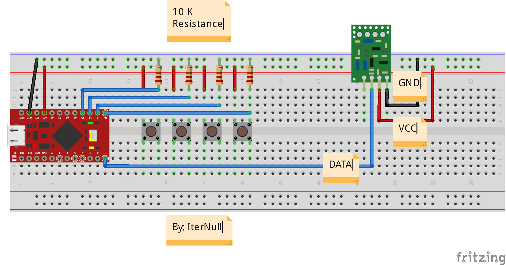
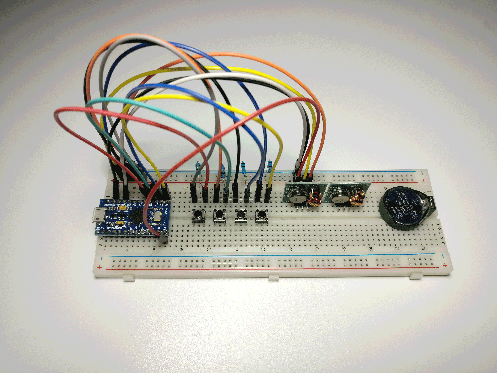

# bruteforce3-8remote

----------

Brute Force Attack `3 ^ 8` Remote Control

# 简介 (Introduction)

这是一个使用 Arduino 硬件来对 3 态 8 位遥控器进行信号暴力穷举攻击的项目。

详细文章: https://blog.iternull.com/posts/2017/02/04/Use-Arduino-brute-force-to-attack-remote-control.html

# 电路 (Circuit)

